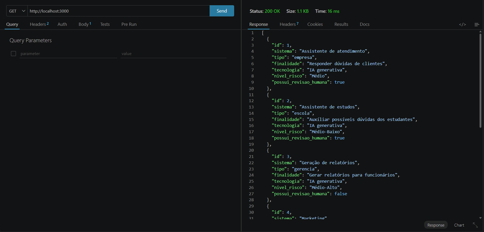
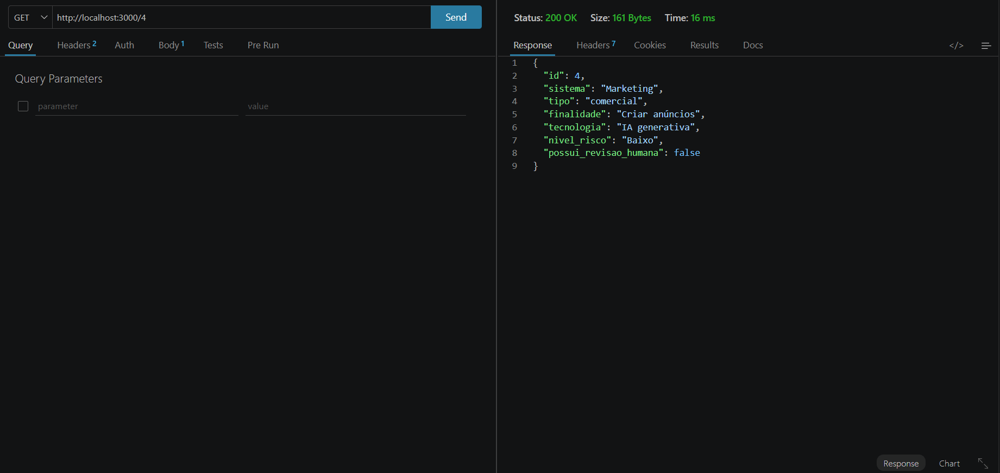
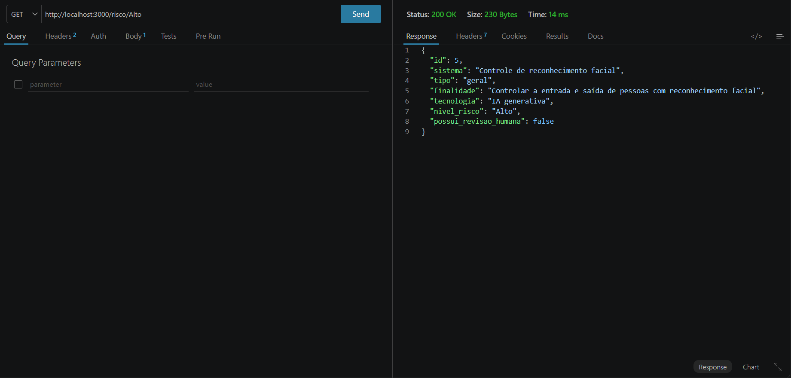
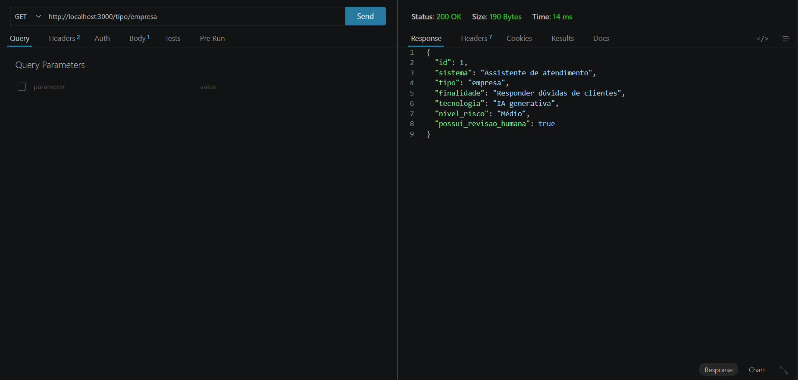
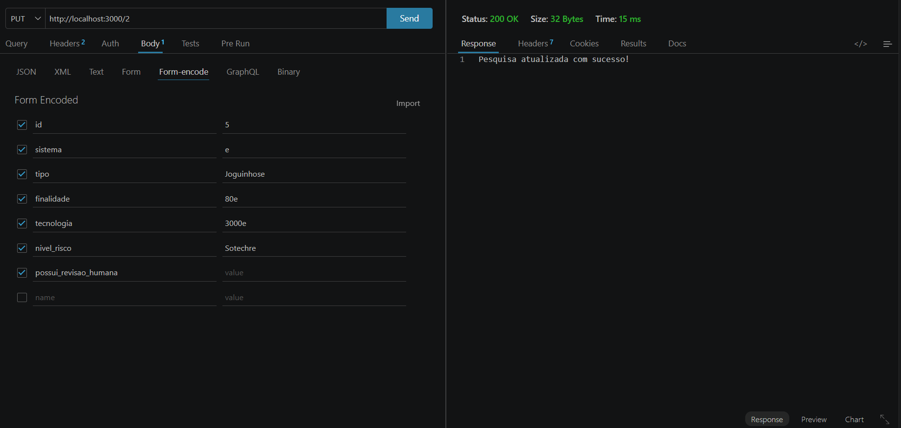
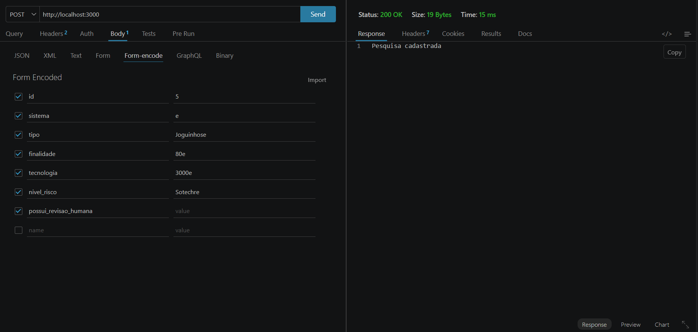
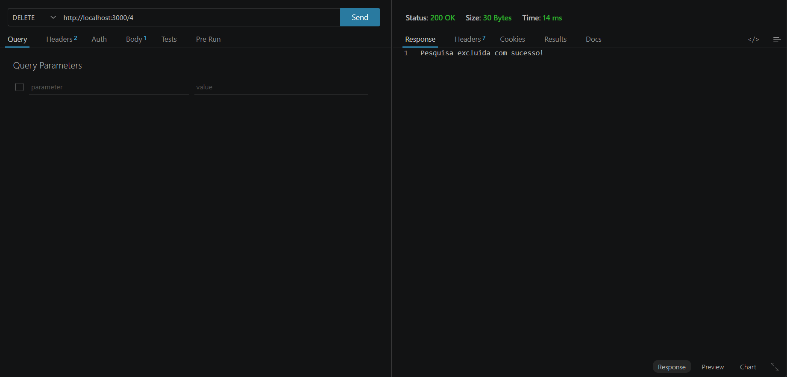

VPS01 - BACK END
Desafio: Tema02 - 🤖 Pesquisa de campo
Um pesquisador da Faculdade de Jaguariúa precisa de um Banco de usos de Inteligência Artificial
Um catálogo para registrar como empresas, escolas ou pessoas estão utilizando IA, incluindo finalidade e possíveis riscos.
Crie um aquivo de dados.json com pelo menos 5 obejetos semelhantes ao abaixo:
```json
[
{
"id": 1,
"sistema": "Assistente de atendimento",
"tipo": "empresa",
"finalidade": "Responder dúvidas de clientes",
"tecnologia": "IA generativa",
"nivel_risco": "Médio",
"possui_revisao_humana": true
}
]
```
CRUD: Cadastrar uso (id com autoIncrement), consultar usos por: [id, nive_risco e tipo], atualizar e excluir registros.
Tecnologias
Node.sj
JavaScript
VsCode
VsCode Thunder Client
Passos para testar
1 Clone este repositório
2 Abra com VsCode e em um terminal digite:
```
npm install
npm run dev
````
3 Teste as rotas com a extensão Thunder Client do VsCode
4 Abra o arquivo client/index.html com a extensão Live Server do VsCode
Print dos testes e exemplo de requisições
Listar

Listar por ID

Listar por Nível

Listar por Tipo

Atualizar

Cadastrar

Excluir

Cliente